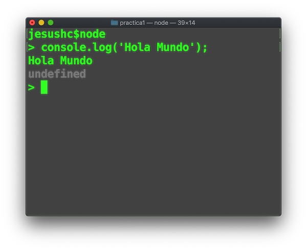
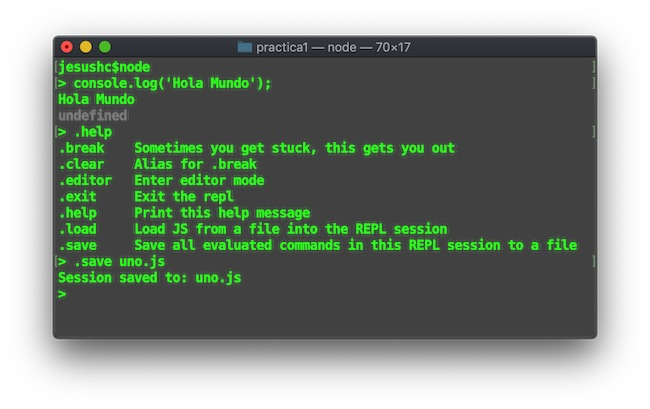

# Consola Node Js

1.- Iniciar la consola node Js


2.- Escribir clásico hola mundo



3.- Desplegar la ayuda con ``` .help ```


4.- Guardar los comandos de la sesion actual con ''' .save [nombre archivo].js '''



5.- Escribir clásico hola mundo


