# Consola Node Js
Usar una consola Linux, si estas usando Windows, emplea la consola ``` Git Bash ``` que proporciona la instalación del cliente ```git ```. Accedemos al ambiente virtual REPL(read–eval–print–loop) tipo python, ruby. Es un entorno sobre el shell de comandos para la ejecución de código javascript soporta un tipo simplificado de Emacs con un conjunto pequeño de comandos. El código ejecutado en el REPL se comportara de la misma forma que ejecutarlo directamente desde un archivo con extensión js ```node archivo.js ```

```Admite un estilo simplificado de Emacs de edición de lineas y un pequeño conjunto de comandos básicos. Lo que escriba en REPL no se procesa de manera diferentemente como si hubieras escrito en JavaScript en un archivo y ejecutar el archivo utilizando Node. Puedes actualmente usar REPL para codificar tu aplicación entera literalmente probando la aplicación en el transcurso. ```
<br>

1.- Iniciar la consola REPL de node Js


2.- Escribir clásico hola mundo


3.- Desplegar la ayuda con ``` .help ```


4.- Guardar los comandos de la sesion actual con ``` .save [nombre archivo].js ```


5.- Cargar el archivo y ejecutarlo ``` .load [nombre archivo].js  ```


6.- Salirse con ```.exit ```


7.- Mostrar el contenido


8.- Ejecuta el archivo desde el prompt

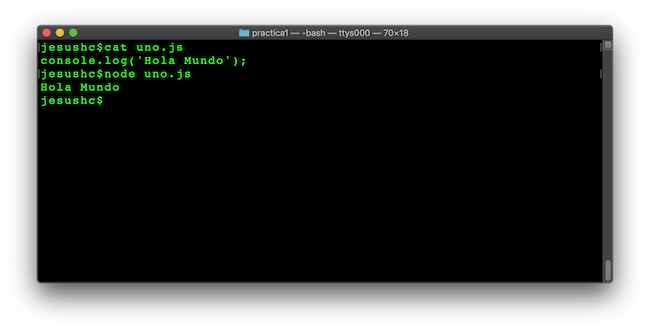

9.- Modifica el archivo para que tenga el siguiente contenido:

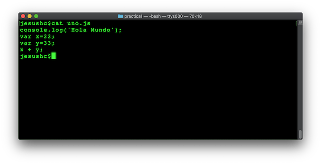

10.- Entra a la consola ``` $node ``` y carga el archivo ``` >.load uno.js ```

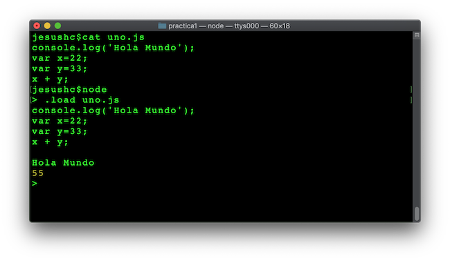

### Tipos de datos primitivos en node.js

* String -> Cadenas de caracteres.
* Number  -> Para tipos numéricos enteros y reales.
* Boolean -> Para los valores true y false.
* Undefined -> Objeto no definido.
* Null -> Identificador para nulo.
* RegExp -> Uso de expresiones regulares sobre texto.


#### Strings

11.- Uso de Strings.
Captura el siguiente código en un archivo con nombre ``` strings.js ```
```
// se pueden declarar usando doble comilla ""
var facultad = "FES Aragón UNAM";
// o comillas simples ''
var carrera = 'Ingeniería en Computación';
// concatena cadena con el operador sobrecargado  +
facultad + " - " + carrera

```

Ejecutar el archivo desde la consola.

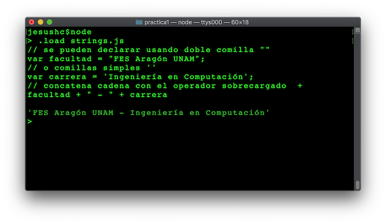

12.- Sin cerrar la consola ejecutar ``` > carrera.length ```

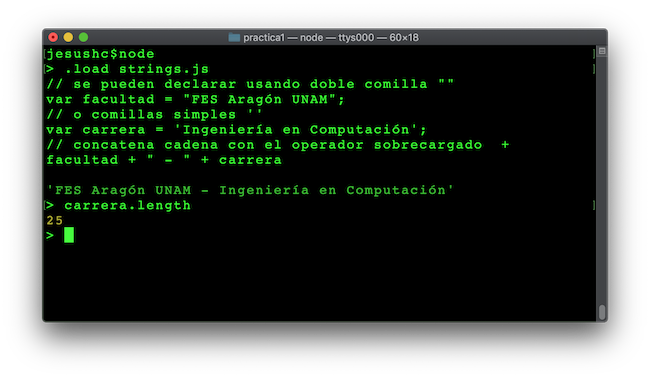

#### Number

var edad=19;


#### Boolean

var flag=true;
flag= false;
if(flag){
  // Haz algo
}

#### Undefined

Cuando un identificador no ha sido asignado a un valor o cuando una expresión no regresa un valor.

```
var edad;
console.log(edad);
```

#### Null

Por otra parte null debe ser asignada a una variable para representar de forma explicita la ausencia de valor o una referencia inexistente(objetos).

```
var nombre=null;
console.log(edad);
```

#### RegExp

Expresiones regulares.
<br>
Las expresiones regulares se usan para la búsqueda de coincidencias en una cadena de texto por medio de un patrón.
Una expresión regular debe ser definida entre dos diagonales.
```
var str = "Esto es un texto muy largo?";
  var patron = /[t]/g;
  var resultado = str.match(patron);
  console.log(resultado);


var t=str.replace(/to/g,"TA");
console.log(t);
console.log(str);

```   


## Arreglos
Un arreglo es una colección de valores organizados consecutivamente en memoria, los cuales se diferencian entre sí por medio de un índice de posición dentro del mismo.

```
//frutas.js
var frutas=[];
frutas[0]="Manzana";
frutas[1]="Pera";
frutas[2]="Melón";
frutas[3]="Fresa";

console.log(frutas);
frutas.push("Sandia");
console.log(frutas);
frutas.pop();
console.log(frutas);
```
Una declaración e inicialización equivalente sería:
```
//frutas2.js
var frutas=["Manzana","Pera","Melón","Fresa"];
console.log(frutas);
frutas.push("Sandia");
console.log(frutas);
frutas.pop();
console.log(frutas);
```

#### Arreglos multidimencionales

```
//dbs.js
var relacionales=["Mysql","PostgreSQL","Oracle","MS SQL Server"];
var noRelacionales=["mongo","CouchDB","Cassandra"];
var databases=[relacionales,noRelacionales];
console.log(databases);
console.log(databases[0][1]);
```


#### Métodos más usados de los arreglos


**forEach** .-El método ```forEach ``` es un método que permite iterar sobre el arreglo.

```
//frutas3.js
var frutas=["Manzana","Pera","Melón","Fresa"];
console.log(frutas);
frutas.push("Sandia");
console.log(frutas);
frutas.pop();
console.log(frutas);

frutas.forEach(function(valor){
 console.log(valor);
});
```
**concat** .- Concatenar cadenas.
```
//frutas4.js  
var frutas=["Manzana","Pera","Melón","Fresa"];
var otrasFrutas=["Piña","plátano","ciruela"];
frutas.concat(otrasFrutas);
 ```


 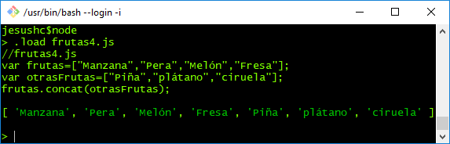

**includes** .- Verifica si un elemento está detro del arreglo.

 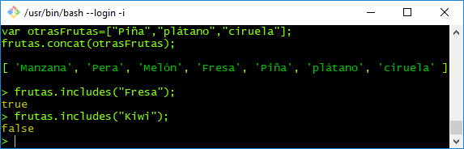


 **indexOf** .- Regresa el índice de un elemento

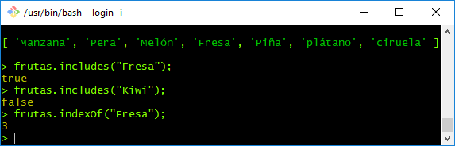


 **slice(starts, ends)** .- Regresa un segmento del arreglo, incluye el inicio pero no el elemento final.


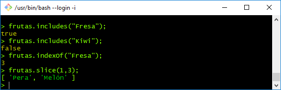

 *continúa...*

## Notación JSON
JSON es el acrónimo de JavaScript Object Notation, Notación de objetos JavaScript. Es un lenguaje de datos independiente del lenguaje de programación.

JSON es una colección de pares llave-valor, los cuales pueden ser anidados.

En la siguiente imagen (fuente json.org) resume la notación JSON, una llave que es de tipo string y un valor. Donde el valor puede ser otro objeto JSON.


La siguiente declaración es la expresión mínima de un objeto JSON.

```
var obj= {"nombre":"Mario"};
console.log(obj);

```
Pero también podría ser así:
```
var obj={"nombre":{
                    "primerNombre":"Mario",
                    "segundoNombre":null,
                    "apellidoPaterno":"Pérez",
                    "apellidoMaterno":"García"
                  }
        }
console.log(obj);
```
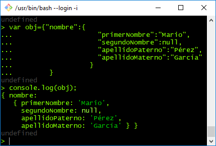

Los nombres de las llaves deben ir entre comillas dobles en la declaración.
El valor puede obtener alguno de los siguientes casos:

1. Un String.
2. Un Number.
3. Un Objeto (puede ser otro JSON).
4. Un arreglo.
5. Un valor Boolean.
6. Null.

Un ejemplo:

```
//cliente.js
var cliente={
  "numCliente": 1234,
  "nombre":{
            "primerNombre":"Mario",
            "segundoNombre":null,
            "apellidoPaterno":"Pérez",
            "apellidoMaterno":"García"
          },
  "telefonos":["04455-2345-2344","55-3987-3432","(721)33221212"],
  "dirección":{
                "calle":"Bosques de Africa",
                "numeroExt":"23-B",
                "colonia":"Bosques de Aragón",
                "cp":57127
              },
   "activo":true,
   "balance":231521.89,
   "prestamos":null
}
```

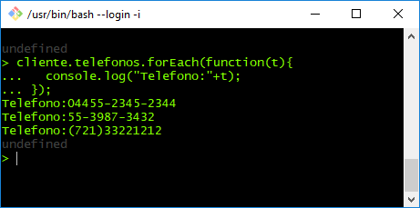

Los siguientes dos conceptos "JSON.stringify" y "JSON.parse" fueron obtenidos del siguiente recurso web: http://www.ecma-international.org/ecma-262/9.0/index.html#sec-json-object

24.5.2 JSON.stringify ( value [ , replacer [ , space ] ] )
<br>
La función stringify devuelve un String en formato JSON codificado en UTF-16 representando un valor ECMAScript. Puede tomar tres parámetros. El valor de parámetro es un valor ECMAScript, suele ser un objeto o arreglo, sin embargo puede ser un String, Boolean, Number o null. El parámetro de reemplazo opcional es una función que altera la forma en que los objetos y arreglos se forman en cadenas, o un arreglo de Strings y Números que actúa como una lista de inclusión para seleccionar las propiedades del objeto que se va clasificar. El parámetro opcional es un String o Número que permite al resultado tener un espacio en blanco inyectado en el para mejorar la legibilidad humana.

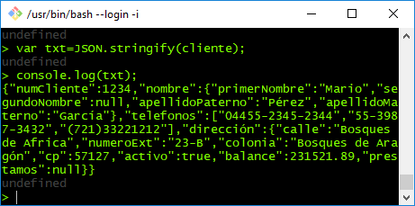

24.5.1 JSON.parse ( text [ , reviver ] )
<br>
La función de análisis analiza un texto JSON (Un String en formato JSON) y produce un un valor ECMAScript. El formato JSON representa literales, arreglos, y objetos con una sintaxis similar a la sintaxis de los literales ECMAScript, inicializadores de arreglos, y inicializadores de objetos. Después de analizar, los objetos JSON se realizan como objetos ECMAScript. Los arreglos JSON se realizan como instancias de arreglo ECMAScript. Las cadenas JSON, números, booleans, y null se realizan como cadenas, números, booleans, y null ECMAScript.   

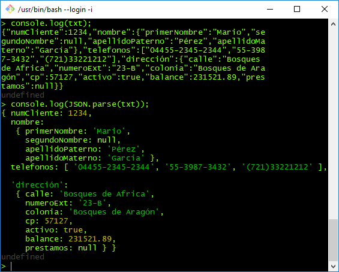

Objetos JSON con funciones


```
//cliente2.js
var cliente={
  "numCliente": 1234,
  "nombre":{
            "primerNombre":"Mario",
            "segundoNombre":null,
            "apellidoPaterno":"Pérez",
            "apellidoMaterno":"García"
          },
  "telefonos":["04455-2345-2344","55-3987-3432","(721)33221212"],
  "dirección":{
                "calle":"Bosques de Africa",
                "numeroExt":"23-B",
                "colonia":"Bosques de Aragón",
                "cp":57127
              },
   "activo":true,
   "balance":231521.89,
   "prestamos":null,
   "retiro":function (val) {
     this.balance-=val;
     console.log(this.balance);
   }
}
```

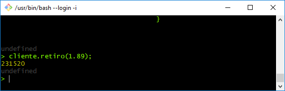
