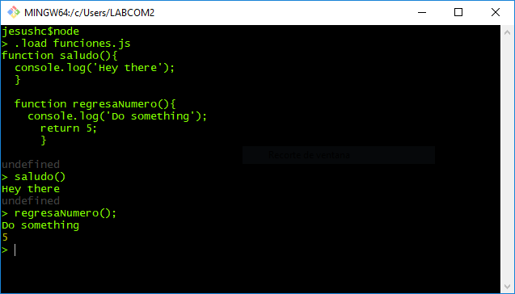
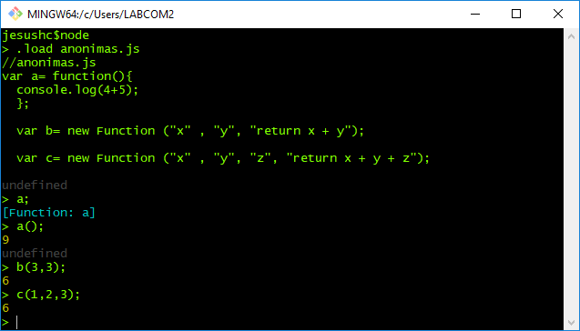
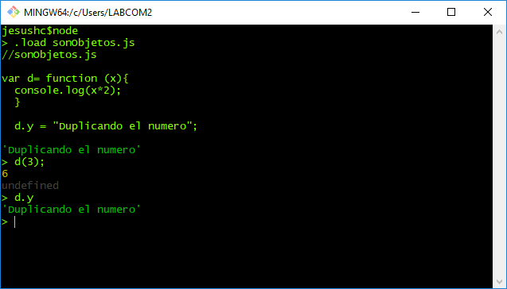
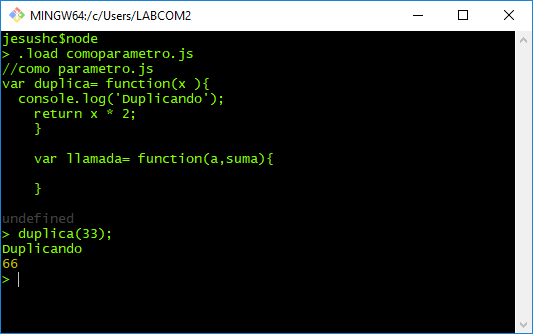

# Funciones
En node js al igual que en Javascript una funcion es una objeto que puede construirse en tiempo de ejecución, pasarse como un parámetro, devolverse desde una subrutina o asignarse a una variable, para luego ser invocada como variable. A esto se le conoce como first-class Object.

A continuación realizaremos ejercicios que nos muestren estas características.
### Declaración de funciones con nombre.

 1.-Primero aprendamos las 3 formas de declarar una función mas empleadas, la siguiente es una función con nombre, justo como la conocemos en otros lenguajes como C y PHP.

```
//funciones.js
function saludo(){
  console.log('Hey there');
}

function regresaNumero(){
  console.log('Do something');
  return 5;
}
```

Inicia REPL de node, carga el archivo y invoca los métodos.



### Declaclaración de funciones anónimas.

2.-funciones anónimas
Las funciones anónimas no tienen un nombre estableido en tre la palabra reservada function y el paso de argumentos, sin embargo es necesario asignarla a una variable para establecer una referencia.


```
//anonimas.js
var a= function(){
  console.log(4+5);
};

var b= new Function ("x" , "y", "return x + y");

var c= new Function ("x" , "y", "z", "return x + y + z");

```
Parámetros y argumentos



### Declaración de funciones como objetos.

3.- Recuerda que la declaraciones de variables son dinámicos y que las funciones son objetos, de tal forma que se le pueden asignar argumentos, como en el siguiente ejemplo:

```
//sonObjetos.js
var d= function (x){
  console.log(x*2);
}

d.y = "Duplicando el numero";

```


Al ser consideradas como objetos, las funciones pueden ser enviadas como parámetro en la llamada a otras funciones.

4.- función como parámetro



5.- callbacks
