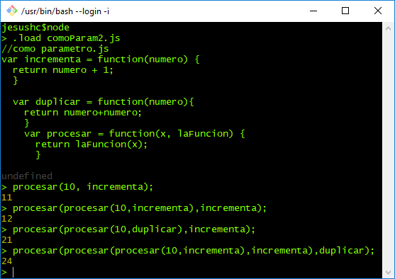
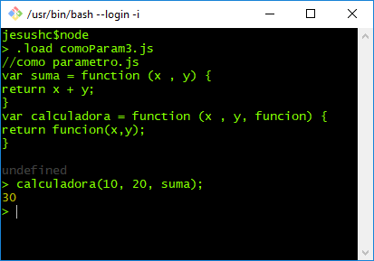
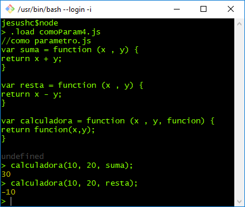
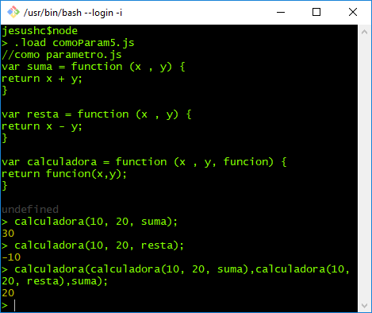
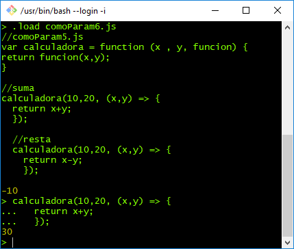
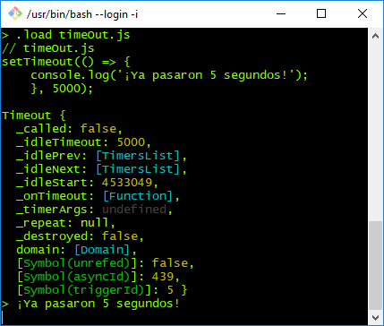

# Funciones
En node js al igual que en Javascript una función es una objeto que puede construirse en tiempo de ejecución, pasarse como un parámetro, devolverse desde una subrutina o asignarse a una variable, para luego ser invocada como variable. A esto se le conoce como first-class Object.

A continuación realizaremos ejercicios que nos muestren estas características.
### Declaración de funciones con nombre.

 1.-Primero aprendamos las 3 formas de declarar una función mas empleadas, la siguiente es una función con nombre, justo como la conocemos en otros lenguajes como C y PHP.

```
//funciones.js
function saludo(){
  console.log('Hey there');
}

function regresaNumero(){
  console.log('Do something');
  return 5;
}
```

Inicia REPL de node, carga el archivo y invoca los métodos.


### Declaclaración de funciones anónimas.

2. Funciones anónimas
Las funciones anónimas no tienen un nombre establecido entre la palabra reservada function y el paso de argumentos, sin embargo es necesario asignarla a una variable para establecer una referencia.


```
//anonimas.js
var a= function(){
  console.log(4+5);
};

var b= new Function ("x" , "y", "return x + y");

var c= new Function ("x" , "y", "z", "return x + y + z");

```
Su ejecución en el RELP sería así:


#### Parámetros y argumentos ####
Antes de continuar tenemos que establecer un par de definiciones relacionadas a las funciones, esto es: la diferencia y/o relación entre parámetros y argumentos.

Un parámetro es la variable o función declarada para recibir valores o referencias y por otro lado los argumentos son las literales que reciben los parámetros como valores o implementación de funciones para su ejecución.
Ejemplo, tomemos como ejemplo la función suma:

```
function suma(a , b){ //parámetros a y b
  return a + b;
}

suma( 3 , 4 );  // argumentos 3 y 4
```

En donde en tiempo de declaración de la variable se establecen los parámetros que recibirán los argumentos *3 y 4* para realizar el cálculo  de la función.


### Declaración de funciones como objetos.

3.- Recuerda que la declaraciones de variables son dinámicos y que las funciones son objetos, de tal forma que se le pueden asignar atributos, como en el siguiente ejemplo, el atributo *y*:

```
//sonObjetos.js
var d= function (x){
  console.log(x*2);
}

d.y = "Duplicando el numero";

```


Al ser consideradas como objetos, las funciones pueden ser enviadas como argumento en la llamada a otras funciones.

## Uso de funciones cómo **argumentos ** a otras funciones. ##
[intro]

4.- Cómo se puede observar en el siguiente código, se pueden definir funciones como parámetro. La función procesa está definiendo dos parámetros, **x** y **laFuncion**.

```
var incrementa = function(numero) {
  return numero + 1;
}

var procesar = function(x, laFuncion) {
  return laFuncion(x);
}
```
La función incrementa es pasada cómo argumento a la función procesa.


Cómo se puede observar una función ```incrementa``` recibe una variable numérica la cual incrementará en 1.

La función ``` procesar ``` por otro lado recibe como parámetros: una variable numérica *x* y una variable que referenciará a una función(**laFuncion**).

por último en el código ```procesar(10,incrementa); ``` se mandan los argumentos 10 y la función previamente definida ```incrementa ```


```
//como parametro.js
var incrementa = function(numero) {
  return numero + 1;
}

var procesar = function(x, laFuncion) {
  return laFuncion(x);
}

procesar(10, incrementa);

```

5. Carga al RELP el archivo comoParam2.js, el cual es una modificación al ejemplo anterior, se agragó la función ```duplicar ```.
Una vez cargado, manda a llamr las funciones mandando los argumentos que se observan en la imagen.



El siguiente código, corresponde a un ejemplo igual pero que define más parámetros.

```
//comoParam3.js
var suma = function (x , y) {
return x + y;
}
var calculadora = function (x , y, funcion) {
return funcion(x,y);
}
```

6. Carga al RELP el archivo comoParam3.js y realiza las llamadas que se observan en la imagen.



7.- Carga al RELP el archivo comoParam4.js y realiza las llamadas a la función calculadora y envía como argumento las funciones suma o resta.



### Funciones totalmente anónimas ###

Ahora, al código anterior se modificó para recibir funciones totalmente anónimas como argumento.

```
//comoParam5.js
var calculadora = function (x , y, funcion) {
return funcion(x,y);
}

//suma
calculadora(10,20,function (x,y) {
  return x+y;
});

//resta
calculadora(10,20,function (x,y) {
  return x-y;
});

```

8. Pruebala en el RELP.




### Otra notación para funciones anónimas como argumento ###
Esta notación es conocida como funciones flecha (Arrow functions) introducido en ECMAScript 6, es una de las características más sobresalientes de esta versión y estan basadas en la notación lambda de varios lenguajes de programación. El objetivo es tener una sintaxis más simple y concisa.

Para más información recomiendo la siguiente lectura:

  https://zendev.com/2018/10/01/javascript-arrow-functions-how-why-when.html


En el siguiente código se expone dicha notación.
```
//comoParam6.js
var calculadora = function (x , y, funcion) {
return funcion(x,y);
}

//suma
calculadora(10,20, (x,y) => {
  return x+y;
});

//resta
calculadora(10,20, (x,y) => {
  return x-y;
});

```
9. Carga el archivo comoParam6.js al REPL y comprueba.




#### Otro ejemplo con un timer de 5 segundos ####  

10. carga el archivo timeOut.js y prueba el funcionamiento.
```
setTimeout(() => {
    console.log('hola');
}, 5000);
```

Resultado:



# NOTA #
Repasa muy bien estos ejemplos, ya que se emplean ampliamente a continuación.
