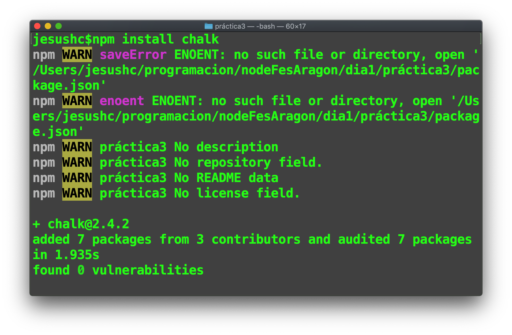
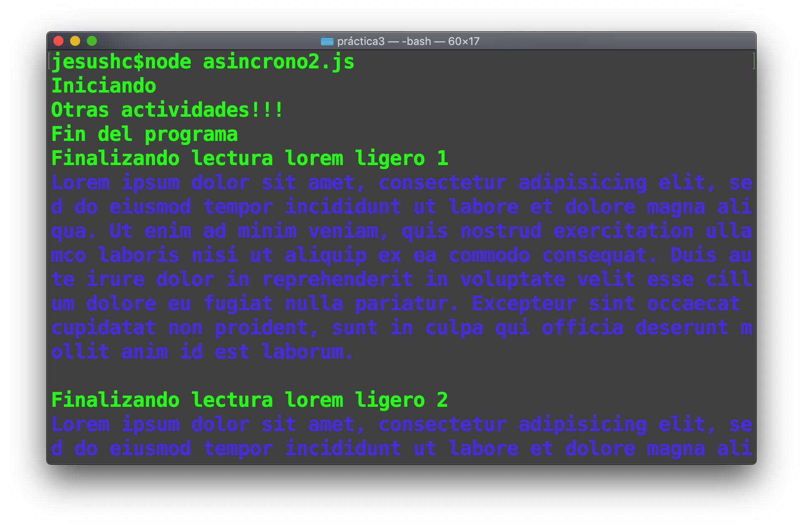
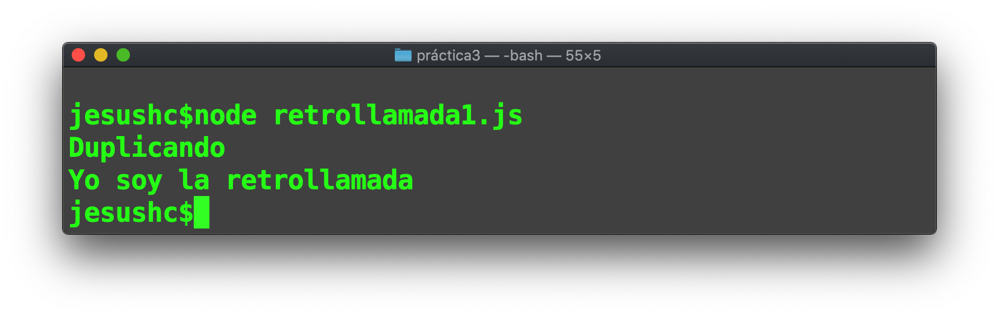

## Node es Asíncrono
Al ser Node.js una tecnología del lado del servidor, es necesario que los tiempos de respuesta de las llamadas a los recursos web sean eficientes, es por eso que las llamadas a Node.js son asíncronas. Es decir que una vez una función es invocada, Node.js no espera a que la ejecución termine para ejecutar la siguiente instrucción, en su lugar se mete la ejecución de la función a una pila de ejecución y cuando esta finalice, saca la función de la pila y continua su ejecución, a esto se le llama callback como en la figura 3-2.

En la siguiente gráfica se representea la diferencia entre una llamada Sincrona y Asincrona.


El siguiente código  realiza una lectura de forma Sincrona.

```
// sincrono.js
var fs = require('fs');
console.log('Iniciando lectura');
var contents = fs.readFileSync('loremLigero.txt', 'utf8');
console.log('Finalizando lectura');
console.log(contents);

console.log('Fin del programa');

```

1. Ejecuta el programa sincrono.js


En el libro de Fernando Doglio:
```

Doglio, F. (2018). REST API Development with Node.js: Manage and Understand the Full Capabilities of Successful REST Development. Berkeley, CA: Apress.

```
Se explica con dos imagenes la diferencia entre estas dos formas de ejecución:


El siguiente ejemplo muestra cómo nodejs ejecuta funciones de forma asincrona, en donde se hace la lectura de un archivo relativamente grande y por lo tanto, nodejs no espera a que finalice dicha acción;

```
var fs = require('fs');

console.log('Iniciando lectura');

fs.readFile('lorem.txt', 'utf8', function(err, contents) {
  console.log('Finalizando lectura');
  console.log(contents);
});

console.log('Otras actividades!!!');
console.log('Fin del programa');

```
2. Carga al REPL o ejecuta desde el shell el programa *asincrono.js* y analiza el resultado en pantalla.


Cómo se puede observar la llamada de la operación ``` readfile ``` requiere de más tiempo para acceder al medio de almacenamiento, por lo cual node no espera a que concluya la operación y de froma asíncrona atiende el final de la lectura.


3. El programa siguietne es una ligera modificación al anterior en donde se leen dos arcivos, uno llamado *loremLigero.txt* con 447 caracteres en total y otro de nombre *lorem.txt* con 17434 caracteres.

```
//asincrono2.js
var fs = require('fs');
const chalk = require('chalk');

console.log('Iniciando');
fs.readFile('loremLigero.txt', 'utf8', function(err, contents) {
  if (err) {
    console.log(chalk.red("error"));
  } else {
    console.log('Finalizando lectura lorem ligero 1');
    console.log(chalk.blue(contents));
  }
});
fs.readFile('lorem.txt', 'utf8', function(err, contents) {
  if (err) {
    console.log(chalk.red("error"));
  } else {
    console.log('Finalizando lectura lorem pesado');
    console.log(chalk.yellow(contents));
  }
});
fs.readFile('loremLigero.txt', 'utf8', function(err, contents) {
  if (err) {
    console.log(chalk.red("error"));
  } else {
    console.log('Finalizando lectura lorem ligero 2');
    console.log(chalk.blue(contents));
  }
});
console.log('Otras actividades!!!');
console.log('Fin del programa');
```
4. Antes de ejecutar y analizar este programa instala el paquete chalk. Chalk es un paquete que permite cambiar de color el texto de salida.




5. Una vez instalada la dependencia, ejecutamos el programa asincrono2.js



Cómo se puede observar, la llamada a la función ```readFile ``` de *loremLigero.txt* es ejecutada inmediatemante en ambas llamadas, sin embargo el archivo *lorem.txt* debe ser procesado asincronicamente.


# Callback's

Una vez que tenemos claros los conceptos de funciones y la ejecución asóncrona e Node.js, podemos hablar de como se procesan los resultados en una función especial de nombre callback (retrollamada).

Un callback es una función que es pasada com argumento a otra función y es ejecutada de forma asincrona, al  momento que la resolución de la solicitud de un recurso externo responda, como por ejemplo una petición http, una consulta a base de datos o un acceso a un archivo físico.

Este tipo de ejecución y resolución de llamados resultan ser algo confusos, sobre todo  al momento de programar sistemas con multiples peticiones de recursos. Node.js no es el autor de este tipo  de programación, lo hereda de javascript, sin embargo casi todo lo que se programará mas adelante con Node.js se resolvare con una llamada ``` callback ```

El siguiente código establece el patron de software para implementar un callback:

```
function duplica2(mensaje, callback){
    console.log(mensaje);
    callback();
}

//llamada
duplica2("Duplicando", function(){
//hacemos algo de lógica de negocio aquí
console.log("Yo soy la retrollamada");
});

```

6. Ejecuta el programa desde el shell


