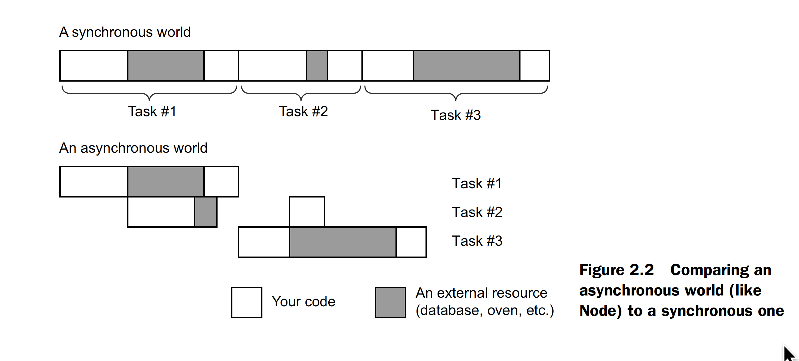
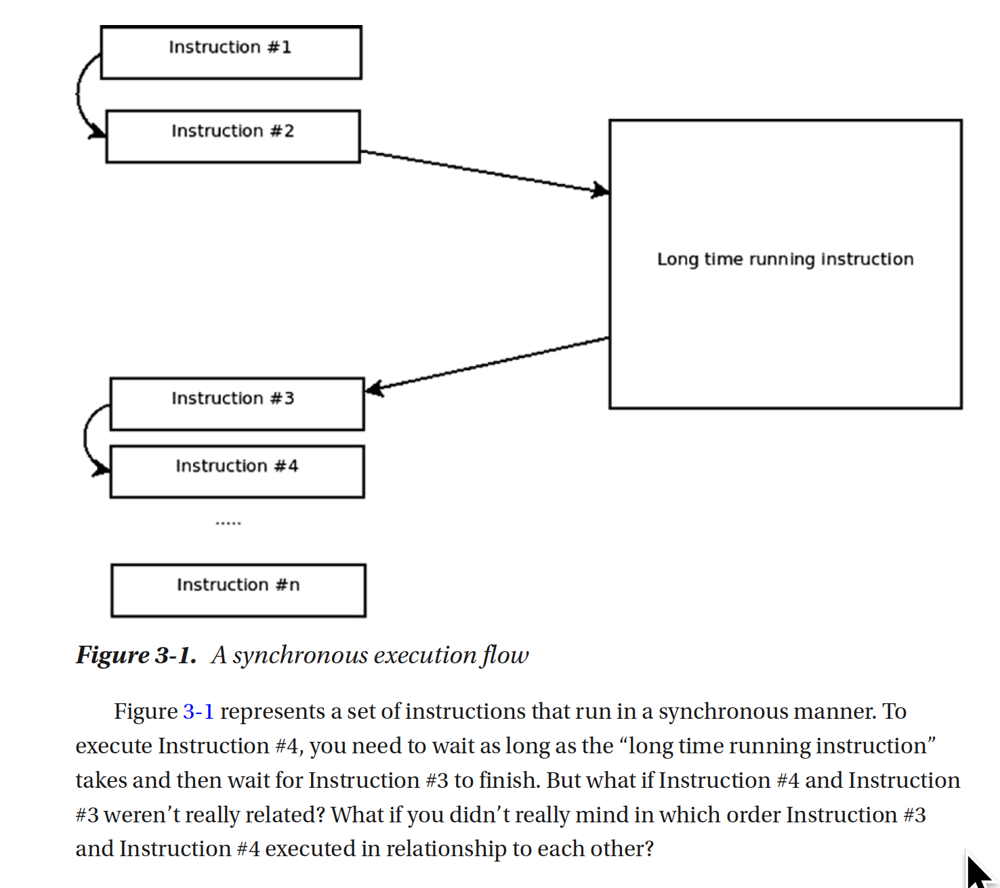
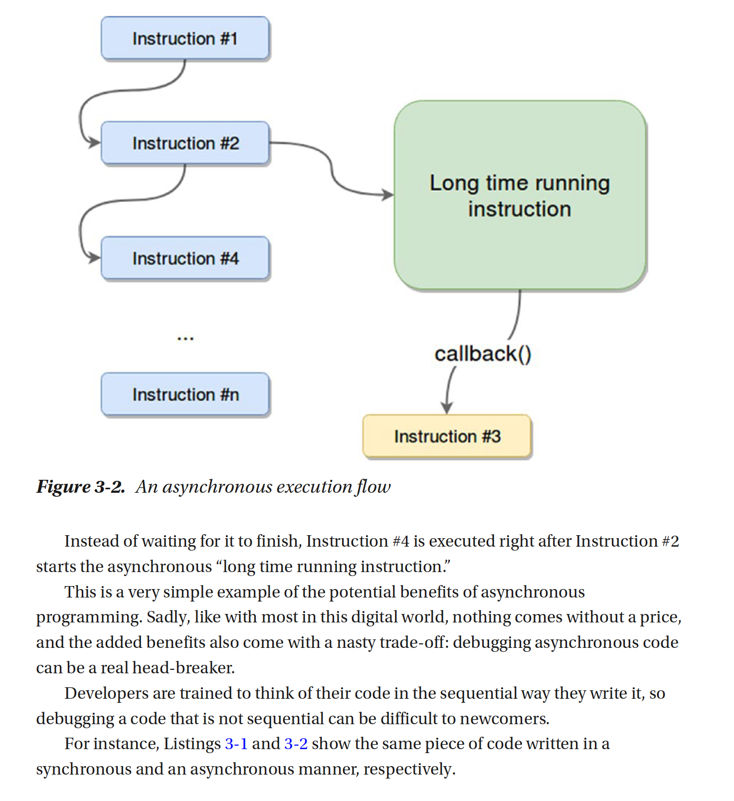
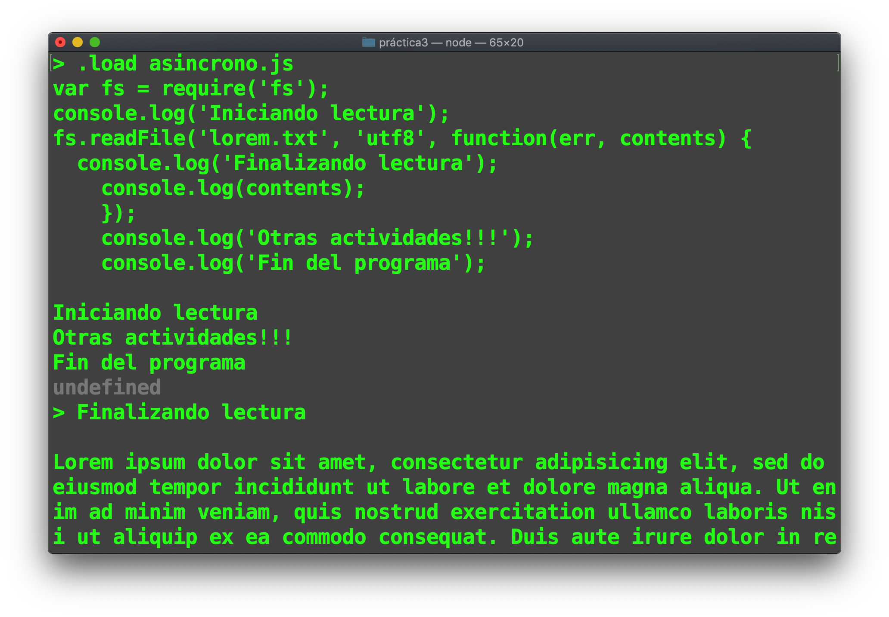

## Node es Asíncrono
Al ser node js una tecnoligía del lado del servidor, es necesario que los tiempos de respuesta de las llamadas a los recursos web sean eficientes, es por eso que las llamadas a NodeJs son asíncronas. Es decir que una vez una función es invocada, nodejs no esspera a que la ejecución termine para ejecutar la siguiente instrucción, en su lugar se mete la ejecución de la función a una pila de ejecución y cuando esta finalice, saca la funcion de la pila y continua su ejecución.

En la siguiente gráfica se representea la diferencia entre una llamada Sincrona y Asincrona.



El siguiente código  realiza una lectura de forma Sincrona.

```
// sincrono.js
var fs = require('fs');
console.log('Iniciando lectura');
var contents = fs.readFileSync('loremLigero.txt', 'utf8');
console.log('Finalizando lectura');
console.log(contents);

console.log('Fin del programa');

```

1. Ejecuta el programa sincrono.js


En el libro de Fernando Doglio:
```
Doglio, F. (2018). REST API Development with Node.js: Manage and Understand the Full Capabilities of Successful REST Development. Berkeley, CA: Apress.
```
Se explica con dos imagenes la diferencia entre estas dos formas de ejecución:





El siguiente ejemplo muestra cómo nodejs ejecuta funciones de forma asincrona, en donde se hace la lectura de un archivo relativamente grande y por lo tanto, nodejs no espera a que finalice dicha acción;

```
var fs = require('fs');

console.log('Iniciando lectura');

fs.readFile('lorem.txt', 'utf8', function(err, contents) {
  console.log('Finalizando lectura');
  console.log(contents);
});

console.log('Otras actividades!!!');
console.log('Fin del programa');

```
2. Carga al REPL o ejecuta desde el shell el programa *asincrono.js* y analiza el resultado en pantalla.



Cómo se puede observar la llamada de la operación ``` readfile ``` requiere de más tiempo para acceder al medio de almacenamiento, por lo cual node no espera a que concluya la operación y de froma asíncrona atiende el final de la lectura.


3. El programa siguietne es una ligera modificación al anterior en donde se leen dos arcivos, uno llamado *loremLigero.txt* con 447 caracteres en total y otro de nombre *lorem.txt* con 17434 caracteres.

```
//asincrono2.js
var fs = require('fs');
const chalk = require('chalk');

console.log('Iniciando');
fs.readFile('loremLigero.txt', 'utf8', function(err, contents) {
  if (err) {
    console.log(chalk.red("error"));
  } else {
    console.log('Finalizando lectura lorem ligero 1');
    console.log(chalk.blue(contents));
  }
});
fs.readFile('lorem.txt', 'utf8', function(err, contents) {
  if (err) {
    console.log(chalk.red("error"));
  } else {
    console.log('Finalizando lectura lorem pesado');
    console.log(chalk.yellow(contents));
  }
});
fs.readFile('loremLigero.txt', 'utf8', function(err, contents) {
  if (err) {
    console.log(chalk.red("error"));
  } else {
    console.log('Finalizando lectura lorem ligero 2');
    console.log(chalk.blue(contents));
  }
});
console.log('Otras actividades!!!');
console.log('Fin del programa');
```

# Callback's
