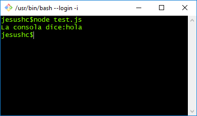
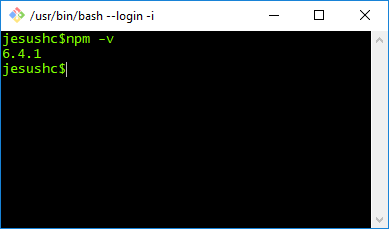
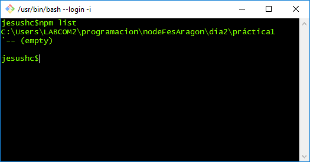
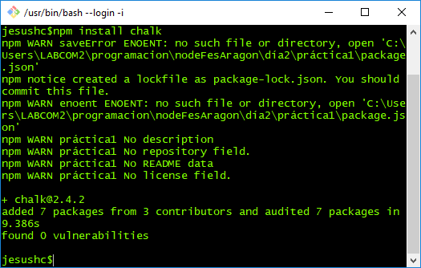
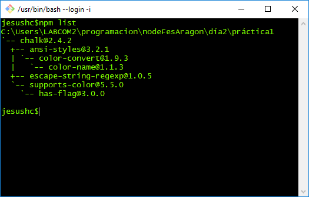
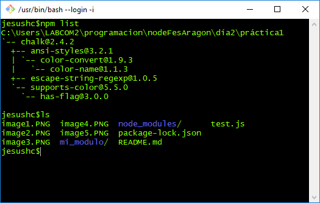
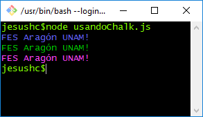
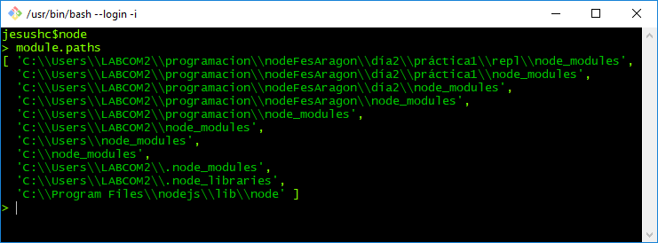

# Introducción a NPM #
Un paquete node es importado a un programa local con la sentencia:
      ``` var chalk= require('chalk') ```

Por ejemplo, chalk es un módulo escrito por un tercero que permite escribir mensajes en la consola on colores por ejemplo:


También puedes importar un módulo escrito por ti. por ejemplo, en la carpeta mi_modulo de esta prática se encuantra configurado un pequeño módulo que nos ayudará a ejemplificar. El código del archivo principal ``` index.js ``` es el siguiente:

```
exports.miConsoleLog=function(msg){
  console.log("La consola dice:"+msg);
}
 ```  

 y tenemos un programa de prueba ``` test.js ``` el cual tiene el siguiente código:

 ```
 var miconsola= require('./mi_modulo/index.js');

 miconsola.miConsoleLog("hola");

 ```

De esta forma podemos reutilizar código escrito previamente. Hay que notar que las funciones a usar por medio de require deben ser declaradas por medio de la sintaxis ``` exports ```.

1. Al ejecutar ``` $node test.js ``` obtenemos lo siguiente:



### importando paquetes publicados ###

Si requerimos utilizar un paquete escrito por un tercero, podemos hacerlo vía la herramienta npm. Para verificar que tenemos la herramienta instalada ejecutamos ``` npm -v ```
2.


Para revisar todos los paquetes instalados localmente ``` npm list ```:



Para instalar localmente el paquete chalk requerimos hacer: ``` npm install chalk ```



Este comando descarga el paquete desde el repositorio general de node (npmjs.com) y lo instala localmente en tu directorio de tu programa. Por lo cual al volver ejecutar ``` npm list ``` debes tener el siguiente resultado:



El árbol mostrado a la salida, muestra todos los módulos instalados localmente. Todos los elementos bajo el nodo chalk@2.4.2 son los paquetes que fueron importados para escribir chalk.

Observa que al listar el contenido de tu carpeta se puede observar la creación de una carpeta nueva de nombre ``` node_modules ```



3. Esribe el programa usandoChalk.js y ejecutalo.

```
//usandoChalk.js
var chalk = require('chalk');
console.log(chalk.blue('FES Aragón UNAM!'));
console.log(chalk.green('FES Aragón UNAM!'));
console.log(chalk.purple('FES Aragón UNAM!'));

```



Para ver la documentación completa de chalk visita: https://www.npmjs.com/package/chalk

En la página: https://www.npmjs.com/ puedes consultar los paquetes disponibles, con más de 960,000 de ellos; lo cuál lo hace el contenedor de biblioteca de software más grande desde el 2017. Tan sólo en una semana puede tener 11 mil millones de descargas.

#### Ejercicio ####
- Ingresa al directorio https://www.npmjs.com/ y consulta el paquete ``` request ``` e implementa un pequeño programa que consulte la página de google: https://www.google.com
- como segunda parte del ejercicio, realiza el request a la url: http://aragonapi.herokuapp.com/api/users
- Realiza el request de la dirección http://aragonapi.herokuapp.com/api/users/1


### require y el directorio node_modules  ###

Cuando en un programa nodejs se invoca a la función require, se inicia un proceso de búsqueda en el directorio node_modules. En primera instancia busca en la carpeta del proyecto y en última instancia en la carpeta de instalación de node.

Para desplegar el orden de búsqueda de los  paquetes, introduce el código: ``` module.paths ```. El cuál es un arreglo que contiene las rutas absoluas de búsqueda de los paquetes.



Cuando se instala un módulo con ``` npm install [nombre_modulo] ``` se instala en el directorio actual.

Si se ejecuta el comando con el argumento -g ``` npm install -g [nombre_modulo] ``` el paquete se instala de forma general para que esté disponible desde cualquier directorio.

Ejemplo 
