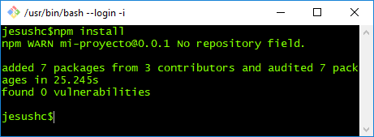
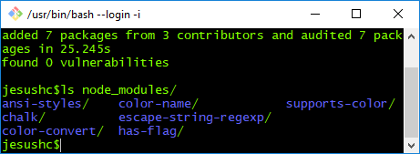
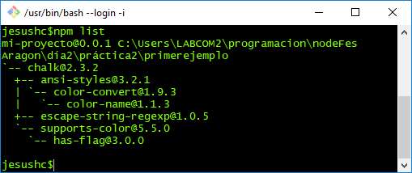
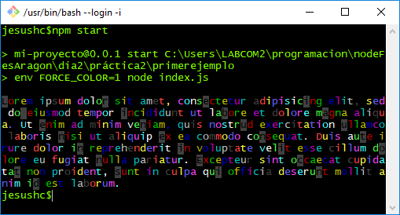
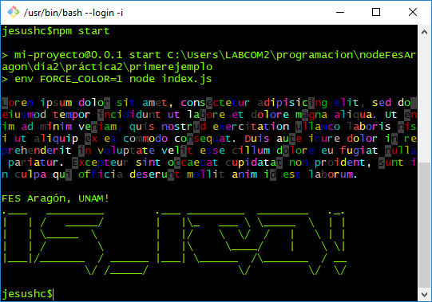
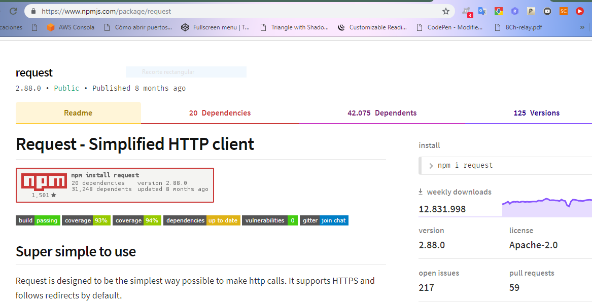
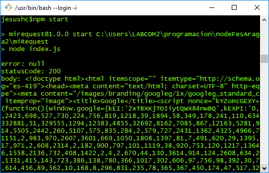
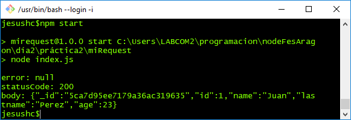

### El archivo **package.json**

Todo proyecto Node.js debe contar con un archivo especial con notación JSON que lo describa. Entre la información que debe contener este archivo esta:

- El nombre del proyecto.
- Una descripción del mismo.
- Versión.
- Autor.
- Información del repositorio CVS.
- Dependencias.
- Entre otros.

Como se muestra a continuación:

```
{
  "name": "mi-proyecto",
  "version": "0.0.1",
  "description": "Un proyecto de ejemplo el cual escribe letras de colores",
  "main": "index.js",
  "scripts": {
    "test": "echo \"Error: no test specified\" && exit 1",
    "start":"env FORCE_COLOR=1 node index.js"
  },
  "author": "jeshc",
  "license": "MIT",
  "dependencies": {
    "chalk": "2.3.x"
  }
}


```

1. Este archivo permitirá a la herramienta NPM realizar actividades automatizadas para el proyecto, como por ejemplo instalarlo, para ello se emplea el comando ``` npm install ```



Cómo se muestra en la imagen se instalan 7 paquetes, producto de la sección ``` dependencies  ```, que consta de la inclusión del paquete chalk.

```
"dependencies": {
  "chalk": "2.3.x"
}
 ```
 2. Podemos observar el contenido de la nueva carpeta *node_modules*

 

 3. Puedes revisar los paquetes instalados para este proyecto con ``` npm list ```

  

4. Una vez instaladas las dependencias es posible ejecutar el proyecto con el comando ``` npm start ``` lo cual ejecutara la sección scripts -> start del archivo package.json:

```
"scripts": {
  "test": "echo \"Error: no test specified\" && exit 1",
  "start":"env FORCE_COLOR=1 node index.js"
}
```

   y producirá el siguiente resultado:

  

Como se puede observar el script *start* tiene configurado la ejecución ``` node index.js ```, cuya lógica puedes explorar abriendo el archivo.

Como se puede ver, también es posible establecer variables de entorno de sistema operativo, para el correcto funcionamiento del proyecto: ``` env FORCE_COLOR=1  ```.

5. Te invito a eliminar esta sección del script start y volver a ajecutar ``` npm start ```

Según la documentación oficial de NPM los scripts aceptados son:

```
prepublish: Run BEFORE the package is packed and published, as well as on local npm install without any arguments. (See below)
prepare: Run both BEFORE the package is packed and published, on local npm install without any arguments, and when installing git dependencies (See below). This is run AFTER prepublish, but BEFORE prepublishOnly.
prepublishOnly: Run BEFORE the package is prepared and packed, ONLY on npm publish. (See below.)
prepack: run BEFORE a tarball is packed (on npm pack, npm publish, and when installing git dependencies)
postpack: Run AFTER the tarball has been generated and moved to its final destination.
publish, postpublish: Run AFTER the package is published.
preinstall: Run BEFORE the package is installed
install, postinstall: Run AFTER the package is installed.
preuninstall, uninstall: Run BEFORE the package is uninstalled.
postuninstall: Run AFTER the package is uninstalled.
preversion: Run BEFORE bumping the package version.
version: Run AFTER bumping the package version, but BEFORE commit.
postversion: Run AFTER bumping the package version, and AFTER commit.
pretest, test, posttest: Run by the npm test command.
prestop, stop, poststop: Run by the npm stop command.
prestart, start, poststart: Run by the npm start command.
prerestart, restart, postrestart: Run by the npm restart command. Note: npm restart will run the stop and start scripts if no restart script is provided.
preshrinkwrap, shrinkwrap, postshrinkwrap: Run by the npm shrinkwrap command.
```
#### Ejercicio:
- Agregar la dependencia ``` "asciify":"asciify" ```.
- Instala las dependencias.
- Importar la biblioteca con ``` require ... ``` el código fuente del proyecto.
- Codifica lo siguiente al final del mismo:

```
asciify('IS_ ICO!', {color: 'green'}, function (err, result) {
	console.log('\nFES Aragón, UNAM!\n' + result);
});
```

- Ejecuta el proyecto nuevamente.

  


### npm init


 Es el comando para inicializar un proyecto, por medio de un asistente en la consola shell.

6. Crea un nuevo proyecto de nombre ejemplo2 con el comando ``` npm init ```.

  - Crea la carpeta *ejemplo2*.
  - Entra a la carpeta y ejecuta ``` npm init ```.
  - Sigue las instrucciones en pantalla.
  - Agrega la dependencia ``` chalk-animation  ``` en la versión 1.6.0.
  - El archivo principal debe ser index.js (por defecto).
  - Verifica que el archivo ```package.json```sea equivalente a:

      ```
        {
          "name": "ejemplo2",
          "version": "1.0.0",
          "description": "ejemplo 2 para la clase",
          "main": "index.js",
          "scripts": {
            "test": "echo \"Error: no test specified\" && exit 1",
            "start": "env FORCE_COLOR=1 node index.js"
          },
          "author": "jesh",
          "license": "MIT",
          "dependencies": {
            "chalk-animation": "1.6.0"
          }
        }
      ```

  - El código para ``` index.js ``` es:

    ```
    const chalkAnimation = require('chalk-animation');

    chalkAnimation.rainbow('ICO FES Aragón UNAM'); // pulse, glitch, radar, meon, karaoke
    setTimeout(() => {
        console.log('fin');
    }, 5000);

    ```

  - Ejecuta ```npm install```  y   ``` npm start ```para observar una animación de de colores.

# paquete request

El paquete request de Node.js es un cliente HTTP simple.

La siguiente imagen muestra la información básica del paquete en la página de npmjs.com.


  

  7. Vámos a usar este paquete para iniciar nuestro camino al consumo de un REST.
  - Crear la carpeta *miRequest*.
  - Entramos a la carpeta e inicializamos un proyecto con ``` npm init ```.
  - Agrega la dependencia ``` request ```.
  - Agrega el script ``` "start": "node index.js" ```.
  - Crea el archivo index.js y copia el siguiente código:

      ```
        // index.js -> código original de la página oficial de request en npmjs.com
        var request = require('request');
        request('http://www.google.com', function (error, response, body) {
          console.log('error:', error); // Print the error if one occurred
          console.log('statusCode:', response && response.statusCode); // Print the response status code if a response was received
          console.log('body:', body); // Print the HTML for the Google homepage.
        });

      ```

  - Ejecuta el proyecto con ```npm start``` .

  - Resultado esperado:

      

  - Modifica el código para solicitar información del API REST de ejemplo: *http://aragonapi.herokuapp.com/api/users/1*
  - Resultado esperado:

      

  - Ahora solicita la información del pokemon pikachu a la [pokeapi](
    https://pokeapi.co/api/v2/pokemon/pikachu/).
    <br>
    Muestra las habilidades de pikachu.
