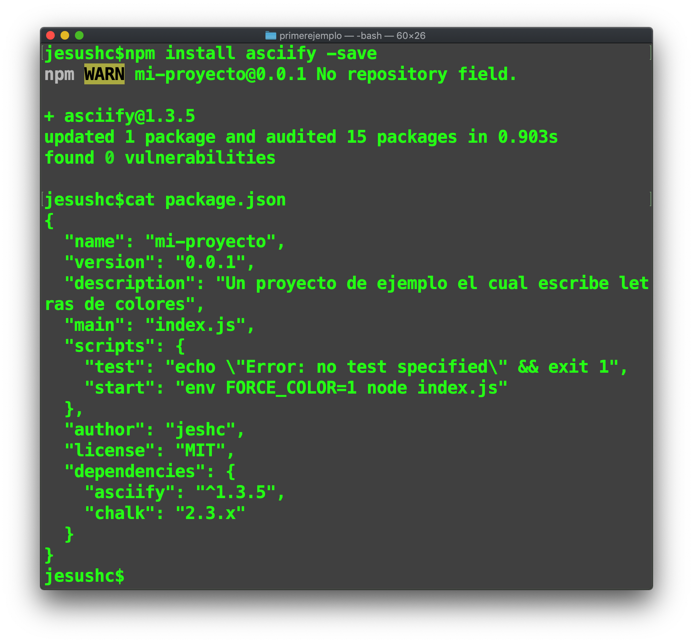

### El archivo **package.json**

Todo proyecto Node.js debe contar con un archivo especial con notación JSON que lo describa. Entre la información que debe contener este archivo estan:

- El nombre del proyecto.
- Una descripción del mismo.
- Versión.
- Autor.
- Información del repositorio CVS.
- Dependencias.
- Entre otros.

Este archivo es empleado por la herramienta NPM para instalar dependencias de forma automatizada, ejecutar las pruebas, ejecutar la aplicación, entre otras. Para comprender el uso de este archivo hagamos el siguiente ejercicio:

1.- Crear una carpeta de nombre *mi-proyecto*
  - Entrar a la nueva carpeta y crear el archivo **package.json**
  - Editar el archivo **package.json** para que contenga el siguiente código:

    ```
    {
      "name": "mi-proyecto",
      "version": "0.0.1",
      "description": "Un proyecto de ejemplo el cual escribe letras de colores",
      "main": "index.js",
      "scripts": {
        "test": "echo \"Error: no test specified\" && exit 1",
        "start":"env FORCE_COLOR=1 node index.js"
      },
      "author": "jeshc",
      "license": "MIT",
      "dependencies": {
        "chalk": "2.3.x"
      }
    }

    ```
      Cómo se puede observar además de la información básica del proyecto, contamos con dos secciones importantes: ```scripts``` y ```dependencies```.
      -> Scripts establece los comandos necesarios para relizar acciones, por ejemplo ejecutar el proyecto 
      -> Dependencies lo emplea NPM para instalar las dependencias de forma automatizada.


2. Este archivo permitirá a la herramienta NPM realizar actividades automatizadas para el proyecto, para instalarlo se emplea el comando ``` npm install ```

  

Cómo se muestra en la imagen se instalan 7 paquetes, producto de la sección ``` dependencies  ```, que consta de la inclusión del paquete chalk.

  ```
  "dependencies": {
    "chalk": "2.3.x"
  }
   ```
3. Podemos observar el contenido de la nueva carpeta *node_modules*

 


4. Puedes revisar los paquetes instalados para este proyecto con ``` npm list ```

  

5. Una vez instaladas las dependencias creamos el archivo principal index.js  y agregamos el siguiente código:


```
       const gis = require('chalk');
       var asciify= require('asciify');
           function pinta(letra, index) {
             gis.enabled=true;
             switch (index) {
               case 0:
                 process.stdout.write(gis.black.bgBlackBright(letra));
                 break;
               case 1:
                 process.stdout.write(gis.red(letra));
                 break;
               case 2:
                 process.stdout.write(gis.green(letra));
                 break;
               case 3:
                 process.stdout.write(gis.yellow(letra));
                 break;
               case 4:
                 process.stdout.write(gis.blue(letra));
                 break;
               case 5:
                 process.stdout.write(gis.magenta(letra));
                 break;
               case 6:
                 process.stdout.write(gis.cyan(letra));
                 break;
               case 7:
                 process.stdout.write(gis.white(letra));
                 break;
               case 8:
                 process.stdout.write(gis.gray(letra));
                 break;
               case 9:
                 process.stdout.write(gis.redBright(letra));
                 break;
               case 10:
                 process.stdout.write(gis.yellowBright(letra));
                 break;
               case 11:
                 process.stdout.write(gis.blueBright(letra));
                 break;
               case 12:
                 process.stdout.write(gis.magentaBright(letra));
                 break;
               case 13:
                 process.stdout.write(gis.cyanBright(letra));
                 break;
               case 14:
                 process.stdout.write(gis.whiteBright(letra));
                 break;
               case 15:
                 process.stdout.write(gis.greenBright(letra));
                 break;
               default:
                 process.stdout.write(gis.red(letra));
             }
           }

           function main() {

             var texto = 'Lorem ipsum dolor sit amet, consectetur adipisicing elit, sed do eiusmod tempor incididunt ut labore et dolore magna aliqua. Ut enim ad minim veniam, quis nostrud exercitation ullamco laboris nisi ut aliquip ex ea commodo consequat. Duis aute irure dolor in reprehenderit in voluptate velit esse cillum dolore eu fugiat nulla pariatur. Excepteur sint occaecat cupidatat non proident, sunt in culpa qui officia deserunt mollit anim id est laborum.';

             var j = 0;

             for (j = 0; j < texto.length; j++) {
               //console.log(texto.charAt(j));
               pinta(texto.charAt(j), j % 16);
             }
             console.log();

           }

           main();

```


6. ejecutar el proyecto con el comando ``` npm start ``` lo cual ejecutara la sección scripts -> start del archivo package.json:


```
"scripts": {
  "test": "echo \"Error: no test specified\" && exit 1",
  "start":"env FORCE_COLOR=1 node index.js"
}
```

   y producirá el siguiente resultado:

  

Como se puede observar el script *start* tiene configurado la ejecución ``` node index.js ```, cuya lógica puedes explorar abriendo el archivo.

También es posible establecer variables de entorno de sistema operativo, para el correcto funcionamiento del proyecto: ``` env FORCE_COLOR=1  ```.

7. Te invito a eliminar esta sección ```env FORCE_COLOR=1 ``` del script start y volver a ajecutar ``` npm start ```

### Documentación de la seccion Scripts


Según la documentación oficial de NPM los scripts aceptados son:

```
prepublish: Ejecutar ANTES de que el paquete esté empaquetado y publicado, así como en la instalación de npm local sin ningún argumento. 
prepare: Ejecuta ambos ANTES de empaquetar y publicar el paquete, en la instalación local de npm sin ningún argumento, y al instalar las dependencias de git. Esto se ejecuta DESPUÉS de prepublish, pero ANTES de prepublishOnly.
prepublishOnly: Ejecutar ANTES de que el paquete esté preparado y empaquetado, SOLAMENTE en la publicación de npm
prepack: Ejecutar ANTES de que un archivo comprimido esté empaquetado (en el paquete npm, en la publicación npm, y al instalar las dependencias de git)
postpack: Ejecutar DESPUÉS de que el archivo tar se haya generado y movido a su destino final.
publish, postpublish: Ejecutar DESPUÉS de que se publique el paquete.
preinstall: Ejecutar ANTES de instalar el paquete
instale, postinstall: ejecute DESPUÉS de que el paquete esté instalado.
preuninstall, uninstall: Ejecutar ANTES de que se desinstale el paquete.
postuninstall: Ejecutar DESPUÉS de que se desinstale el paquete.
preversion: Ejecutar ANTES de encontrarse con la versión del paquete.
version: Ejecute DESPUÉS de encontrarse con la versión del paquete, pero ANTES de confirmar.
postversion: Ejecute DESPUÉS de encontrarse con la versión del paquete, y DESPUÉS de confirmar.
pretest, test, posttest: Ejecutado por el comando de prueba npm.
prestop, stop, poststop: Ejecutado por el comando npm stop.
prestart, start, poststart: Ejecutado por el comando de inicio npm.
prerestart, restart, postrestart: Ejecutado por el comando npm restart. Nota: npm restart ejecutará los scripts de stop y start si no se proporciona un script de restart
preshrinkwrap, shrinkwrap, postshrinkwrap: Ejecutado por el comando shrinkwrap npm.
```

#### Ejercicio:

- Agregar la dependencia ``` "asciify":"asciify" ```
- Instala las dependencias
- Importar la biblioteca con ``` require ... ``` el código fuente del proyecto.
- Codifica lo siguiente al final del mismo:

```
asciify('IS_ ICO!', {color: 'green'}, function (err, result) {
	console.log('\nFES Aragón, UNAM!\n' + result);
});
```

- Ejecuta el proyecto nuevamente.

  


### npm init


 Es el comando para inicializar un proyecto, por medio de un asistente en la consola shell.

8. Crea un nuevo proyecto de nombre ejemplo2 con el comando ``` npm init ```.

  - Crea la carpeta *ejemplo2*.
  - Entra a la carpeta y ejecuta ``` npm init ```.
  - Sigue las instrucciones en pantalla.
  - Agrega la dependencia ``` chalk-animation  ``` en la versión 1.6.0.
  - El archivo principal debe ser index.js (por defecto).
  - Verifica que el archivo ```package.json```sea equivalente a:

      ```
        {
          "name": "ejemplo2",
          "version": "1.0.0",
          "description": "ejemplo 2 para la clase",
          "main": "index.js",
          "scripts": {
            "test": "echo \"Error: no test specified\" && exit 1",
            "start": "env FORCE_COLOR=1 node index.js"
          },
          "author": "jesh",
          "license": "MIT",
          "dependencies": {
            "chalk-animation": "1.6.0"
          }
        }
      ```

  - El código para ``` index.js ``` es:

    ```
    const chalkAnimation = require('chalk-animation');

    chalkAnimation.rainbow('ICO FES Aragón UNAM'); // pulse, glitch, radar, meon, karaoke
    setTimeout(() => {
        console.log('fin');
    }, 5000);

    ```

  - Ejecuta ```npm install```  y   ``` npm start ```para observar una animación de colores.

## Otros comandos NPM

#### npm install --save
Instala el paquete de forma local y agrega las dependecias al archivo ```package.json```

9. Al  ejercicio anterior agregar el paquete ``` asciify ``` que es un paquete para crear banners con caracteres ASCII.

   


#### npm install --save-de

Lo mismo que la anterior pero solo para desarrollo. No se incluyen en producción.


#### npm install -g <nombre_paquete>
Le indica a NPM que instale el paquete de forma global.

#### npm uninstall <nombre_paquete>
Elimina de forma local el paquete. Para eliminar de forma global agregar el argumento **-g**.

#### npm update -save
Actualiza los paquetes a sus versiones mas actuales. Modifica el archivo package.json si es necesario.


# paquete request

El paquete request de Node.js es un cliente HTTP simple.

La siguiente imagen muestra la información básica del paquete en la página de npmjs.com.


  

  10. Vámos a usar este paquete para iniciar nuestro camino al consumo de un REST.
    - Crear la carpeta *miRequest*.
    - Entramos a la carpeta e inicializamos un proyecto con ``` npm init ```
    - Agrega la dependencia ``` request ```
    - Agrega el script ``` "start": "node index.js" ```
    - Crea el archivo index.js y copia el siguiente código:

      ```
        // index.js -> código original de la página oficial de request en npmjs.com
        var request = require('request');
        request('http://www.google.com', function (error, response, body) {
          console.log('error:', error); // Print the error if one occurred
          console.log('statusCode:', response && response.statusCode); // Print the response status code if a response was received
          console.log('body:', body); // Print the HTML for the Google homepage.
        });

      ```


  - Ejecuta el proyecto con ```npm start``` .

    - Resultado esperado:

      

    - Modifica el código para solicitar información del API REST de ejemplo: *http://aragonapi.herokuapp.com/api/users/1*
    - Resultado esperado:

      


  - Ahora solicita la información del pokemon pikachu a la [pokeapi](
    https://pokeapi.co/api/v2/pokemon/pikachu/).
    <br>
  - Muestra las habilidades de pikachu.


# Un servidor Web con Node JS
    En esta sección vamos a crear nuestro primer servidor web usando el paquete http.
