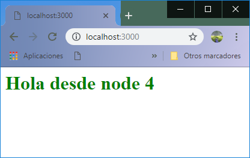
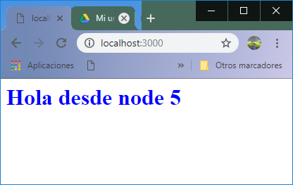
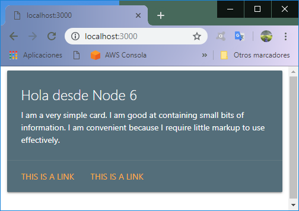
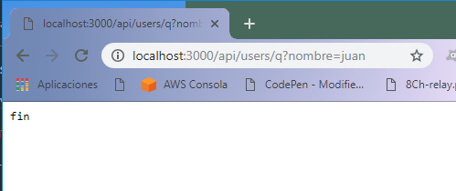
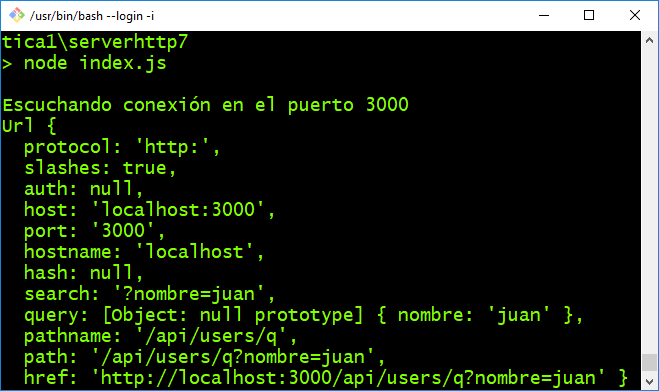

# paquete http de Node.js

```http``` es un paquete del core de Node.js que nos permite crear un servidor de páginas web de forma sencilla y es el módulo base para la construcción del modulo express, el  objetivo de este curso.

A continuación se exploran las caracterisitcas base de este módulo a traves de  un proyecto, en diversas versiones, las cuales van desde ```serverhttp0``` hasta el proyecto ```serverhttpN```. Mismos que van desde el servidor web más simple , hasta el procesamiento de rutas ```http``` y servir archivos estáticos.

```http``` forma parte del núcleo de Node.js y como tal no tiene una versión especifica, ya que se administra con la versión general de Node.js. ```Http``` es un módulo que habilita acceso a internet a tu programa.

Su principal funcion es ``` createServer() ```  la cuál recibe como argumento una función anónima que precesará las peticiones, pero además se quedará a la escucha de forma continua. A esta función se le conoce como la funcion ```requestListener ```. Ahora, esta funcion recibe dos objetos ```http.ServerRequest``` que representa la petición al servidor y un ```objeto``` que representa la repuesta que se le dará al cliente.

```request``` recibe la información de la petición de la página ```http``` tales cómo información de un formulario, verbo de la petición (GET, POST) y el cuerpo de la petición (si es el caso).

```response```, es el objeto en donde se debe escribir la respuesta para mandarla al programa cliente(Chrome por ejemplo).

El siguiente código corresponde a la versión minima de un servidor web, sin embargo este código en particular aún no envía respuesta.

```
var Http = require('http');
var server = Http.createServer();

server.listen(3000, function() {
  console.log('Escuchando conexión en el puerto 3000');
});
```

#### serverhttp0


1. Ingresa a la carpeta ```serverhttp0 ``` instala el proyecto con ```npm install``` y ejecuta  con ``` npm start ```.

  

2. Esto producirá que el servidor empiece a escuchar en el puerto de red 3000. Entra a la dirección ```localhost:3000 ``` y observa que el servidor aun no responde, debido a que no hemos indicado como responder a una petición.

  


  En el siguiente código se agrega la función anónima antes mencionada.

3. Antes de abrir la versión ``` serverhttp1 ```   del proyecto, codifica ``` serverhttp0 ```  para que sea igual a lo siguiente:


#### serverhttp1

```
  var Http = require( 'http' );
  var server = Http.createServer(function(request,response){
      console.log('Alguien entró');
  });

  server.listen( 3000, function( ) {
    console.log( 'Escuchando conexión en el puerto 3000' );
  });
```

3. Ejecuta nuevamente el proyecto del código ``` serverhttp1 ``` para obtener el resultado de la siguiente imagen cada vez que ingresemos vía el web browser.


**Nota.-** La función recien agregada, es una función ```callback``` que se ejecuta de forma asíncrona.

Cómo se puede observar la función ```requestListener``` responde con un  ```console.log('Alguien entró') ``` cada vez que un usario ingresa a la dirección web del servidor en el puerto 3000.

Al igual que el ejercicio anterior el web browser se queda en espera de la respuesta, debido a que no hemos escrito nada de el objeto ```request ```, avancemos y agreguemos una respuesta.

#### serverhttp2

```
var Http = require( 'http' );
var server = Http.createServer(function(request,response){
    console.log('Alguien entró');
    response.write("Hola desde el node");// no se envía por que no se indica fin de la respuesta

});

server.listen( 3000, function( ) {
console.log( 'Escuchando conexión en el puerto 3000' );
});
```

Al probar el programa el resultado debe ser el mismo, a pesar que ya se está escribiendo respuesta sobre el objeto ``` response ``` , lo que hace falta es indicar que ya se terminó de escribir sobre el mismo. Esto se logra invocando la función ***end*** de la forma ``` response.end() ```.

#### serverhttp3

```
var Http = require( 'http' );

var server = Http.createServer(function(request,response){
    //console.log('Alguien entró');
    response.writeHead(200, {'Content-Type': 'text/html'}); // cabecera http
    response.write("<h1>Hola desde el node 3</h1>");// no se envía por que no se indica fin del documento
    response.end(); // al fín se envía

});

server.listen( 3000, function( ) {
console.log( 'Escuchando conexión en el puerto 3000' );
});

```

Las modificaciones consisten en:
  - Establecer la cabecera de respuesta: ``` response.writeHead(200, {'Content-Type': 'text/html'}); ``` lo cual le indica al servidor el código ```http``` de respuesta. Los códigos de respuesta ```HTTP``` se pueden consultar [Aquí.](https://developer.mozilla.org/en-US/docs/Web/HTTP/Status) y las cabeceras [Aquí.](https://www.w3.org/Protocols/rfc2616/rfc2616-sec14.html)
  - En este caso se establece que el contendido de la respuesta es texto ***html***, documentación de los tipos de ``` content-type ``` las puedes consultar [Aquí](https://www.w3.org/Protocols/rfc2616/rfc2616-sec14.html)
  -  Escribimos una respuesta en lenguaje ***HTML*** de la forma: ``` response.write("<h1>Hola desde el node 3</h1>");  ```. Este texto al ser recibido por el cliente Browser se interpreta y renderiza.
  - Se invoca a la función **end()** Lo que provoca que se da por terminada la respuesta y se envíe la respuesta al cliente Web Browser.
  - El resultado es:

4.- Ejecuta el programa ```serverhttp3 ``` y observa el resultado:


## Al fin, ya tenemos nuestro primer servidor web con Node.js

5. **Ejercicio.-**
  - Imprime en la consola el contenido del objeto request ``` console.log(request) ``` .
  - Examina la sección headers y url de la misma.
  - Examina la sección ``` METHOD ```
  - Ahora, imprime solamente el  contenido de **request.url**
  - Ahora, imprime solamente el  contenido de **request.headers**


#### serverhttp4

Ahora, reescribamos el programa anterior para delegar a una función la responsabilidad de proporcionar el texto de respuesta.
Cómo parte de la modificación tambien se anexa color verde a la cabecera H1 de HTML. ```<h1 style="color:green" > ```

```
var Http = require( 'http' );

var data=function(){
  return '<h1 style="color:green" > Hola desde node 4</h1>';
}

var server = Http.createServer(function(request,response){
    console.log('Alguien entró');
    response.writeHead(200, {'Content-Type': 'text/html'}); // cabecera http
    response.write(data());
    response.end(); // al fín se envía
});

server.listen( 3000, function( ) {
console.log( 'Escuchando conexión en el puerto 3000' );
});
```

Al ingresar al servidor, el resultado esperado es el siguiente:




#### serverhttp5

En el ```serverhttp5``` serviremos el mismo contenido, ahora desde un archivo. Para ello empleamos el paquete ``` fs ```.

```
var Http = require('http');
var fs = require('fs');

var server = Http.createServer(function(request, response) {
  fs.readFile('saludo.html', function(err, data) {
    if (err) {
      console.log(err);
      response.end("error");
    } else {
      response.writeHead(200, {
        'Content-Type': 'text/html'
      }); // cabecera http
      response.write(data);
      response.end(); // al fín se envía
    }
  });
```
El contenido del archivo **saludo.html** es:

```
<h1 style="color:blue" > Hola desde node 5</h1>
```

Dando como resultado esto:




#### serverhttp6

6. **Ejercicio**
 - Modificar el archivo ```html``` y agregar el CDN del framework CSS de materialize.
 - Agregar el ejemplo html cards: https://materializecss.com/cards.html.
 - El resultado esperado es este:

 


 ## ¿Qué es una URL ?
Uniform Resource Locator (Localizador uniforme de recursos). Los recursos que existen en Internet.
En el caso de una página wed, la estructura de la URL la podemos ver con el siguiente ejemplo:
http://aragonapi.herokuapp.com
- http: Es un protocolo de seguridad, Google solo quiere https, el http no se recomienda.
-www: subdominio (Las 3w pueden aparecer o no, según lo hayas determinado)
-aragonapi.herokuapp: Nombre del dominio
-.com: Extensión o TLD
## Parsing de URL´s

Dentro del desarollo web es necesario saber en el back end cual es el recurso que solicita el cliente, junto con los valores enviados por el mismo. Es por eso que cómo parte de la API core de node.js existe un paquete llamado ```url ```. Este módulo nos permite extraer la información de la URL del cliente, la cual viene enpaquetada en el cuerpo de la petición ``` request ```.

La siguiente es la documentación de como Node.js (https://nodejs.org/api/url.html) nombra a las partes de una URL.

```

┌────────────────────────────────────────────────────────────────────────────────────────────────┐
│                                              href                                              │
├──────────┬──┬─────────────────────┬────────────────────────┬───────────────────────────┬───────┤
│ protocol │  │        auth         │          host          │           path            │ hash  │
│          │  │                     ├─────────────────┬──────┼──────────┬────────────────┤       │
│          │  │                     │    hostname     │ port │ pathname │     search     │       │
│          │  │                     │                 │      │          ├─┬──────────────┤       │
│          │  │                     │                 │      │          │ │    query     │       │
"  https:   //    user   :   pass   @ sub.example.com : 8080   /p/a/t/h  ?  query=string   #hash "
│          │  │          │          │    hostname     │ port │          │                │       │
│          │  │          │          ├─────────────────┴──────┤          │                │       │
│ protocol │  │ username │ password │          host          │          │                │       │
├──────────┴──┼──────────┴──────────┼────────────────────────┤          │                │       │
│   origin    │                     │         origin         │ pathname │     search     │ hash  │
├─────────────┴─────────────────────┴────────────────────────┴──────────┴────────────────┴───────┤
│                                              href                                              │
└────────────────────────────────────────────────────────────────────────────────────────────────┘
(all spaces in the "" line should be ignored — they are purely for formatting)

```

Para obtener el url desde un programa node.js vamos a requerir importar el paquete de la fomra ``` var url = require('url') ``` y una vez realizado esto podemos realizar un ``` url.parse(direccion) ``` para acceder a los diferentes componentes de la misma.

El siguiente código, es una forma de obtener la información del URL desde las cabeceras HTTP y la url. Todas extraidas del objeto request.

#### serverhttp7

```
var Http = require('http');
var url = require('url');

var server = Http.createServer(function(request, response) {

  var uri = (request.connection.encrypted ? 'https': 'http') + '://' + request.headers.host + request.url;
  var uri_parseada = url.parse(uri,true);
  console.log(uri_parseada);
  response.end('fin');
});

server.listen(3000, function() {
  console.log('Escuchando conexión en el puerto 3000');
});

```

Al solicitar el recurso como se muestra en la siguiente imagen:



El resultado es el siguiente:



7. **Ejercicio:** Modifica el código del proyecto serverhttp7 para que:
 - Cuando se solicite el path ``` /hola ``` se responda con una página HTML con un saludo en texto verde.
 - Cuando se solicite el path ``` /adios ``` se responda con una página HTML con un texto de despedida en color azul.
 - Cuando se solicite el path ``` /card ``` se responda con una página HTML con una card de Materialize.
 - Cuando se solicite el path ``` /saludo ``` se responda con contenido **JSON** ``` {"metodo":"GET" , "mensaje":"Hola"} ```


#### serverhttp8

8. **Ejercicio:** Módifica el proyecto serverhttp8 para que:
 - Cuando se solicite el path ``` /hola ``` y el METHOD=GET, responda con el contenido JSON:
    ``` {"metodo":"GET" , "mensaje":"Hola"} ```
 - Cuando se solicite el path ``` /hola ``` y el METHOD=POST, responda con el contenido JSON:
       ``` {"metodo":"POST" , "mensaje":"Hello", "accion":"guardar en bd"} ```
 - Cuando se solicite el path ``` /hola ``` y el METHOD=PATCH, responda con el contenido JSON:
       ``` {"metodo":"PATCH" , "mensaje":"Bongiorno", "accion":"Actualizar en bd"} ```
 - Cuando se solicite el path ``` /adios ``` y el METHOD=GET, responda con el contenido JSON:
       ``` {"metodo":"GET" , "mensaje":"Adios"} ```
 - Cuando se solicite el path ``` /adios ``` y el METHOD=POST, responda con el contenido JSON:
       ``` {"metodo":"POST" , "mensaje":"Bye", "accion":"guardar en bd"} ```
 - Cuando se solicite el path ``` /adios ``` y el METHOD=PATCH, responda con el contenido JSON:
       ``` {"metodo":"PATCH" , "mensaje":"Ciao", "accion":"Actualizar en bd"} ```

***NOTA.-*** Se requiere modificar la cabecera ``` Content-Type ```
