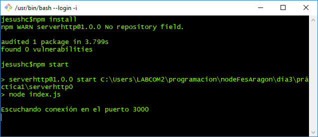
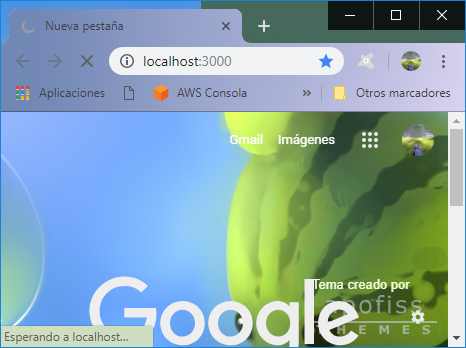
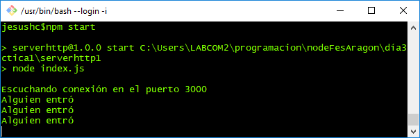
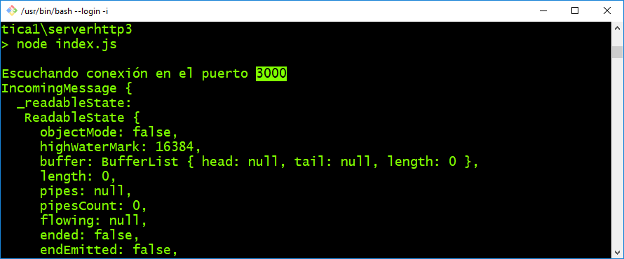

# paquete http de node.js
http es un paquete del core de Node.js que nos permite crear un servidor de páginas web de forma sencilla y es el módulo base para la construcción del modulo express, el módulo objetivo de este curso.

 ``` npm install ``` ccc






```
// error de life cycle
$ npm cache clean --force

```
#### serverhttp1

```
  var Http = require( 'http' );
  var server = Http.createServer(function(request,response){
      console.log('Alguien entró');
  });

  server.listen( 3000, function( ) {
  console.log( 'Escuchando conexión en el puerto 3000' );
  });

 ```
 
2.







