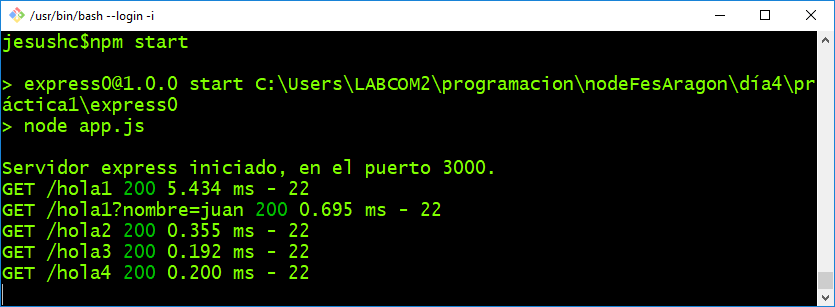
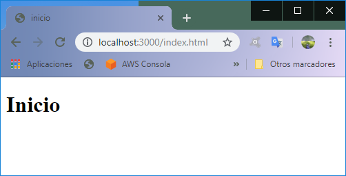
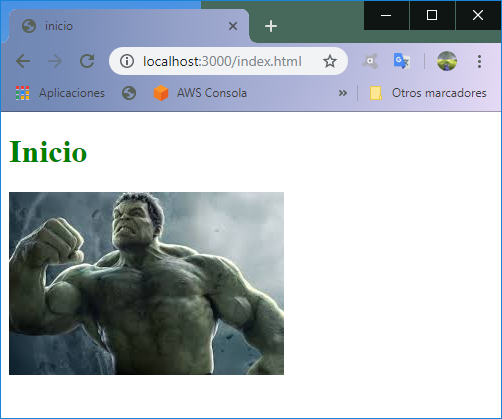

# Introducción al framework Express.js
#### Qué es Express.
Es un framework para el desarrollo de aplicaciones Web basado en el paquete ```http``` de Node.js  y  el módulo [Connect](https://github.com/senchalabs/connect), que se encarga de unir otros módulos para expandir la funcionalidad de Express(Middleware).

Este framework automatiza las actividades repetitivas al escribir aplicaciones web de forma tradicional como por ejemplo:

- Extrayendo los parámetros de un formulario.
- Extracción de datos de los cuerpos HTTP (request bodies).
- Manejo de rutas anidando estructuras if.
- Parsing de  cookies
- manejo de sesiones de cliente.
- Estableciendo las cabeceras ```http``` de acuerdo con la respuesta.
- Manejo de errores.

Express esta escrito para reutilizar estas características de forma elegante con una arquitectura parecida al ```MVC``` (Modelo-Vista-Controlador).

# Empecemos con un ejemplo básico

1.- El hola mundo clásico y obligado.


```
//holamundo.js
var express = require("express");
var app = express();
app.get("/", function(request, response) {
  response.send("¡Hola mundo Express !");
});

app.listen(3000, function() {
  console.log("Servidor express iniciado, en el puerto 3000.");
});
```


## Manejo de rutas

Como ya se mencionó antes Express simplifica muchas tareas tediosas de programar solamente con ```http```, una de ellas es manejar rutas. En lugar de tener lo siguiente con ```http```:
```
var uri = (request.connection.encrypted ? 'https': 'http') + '://' + request.headers.host + request.url;
  var uri_parseada = url.parse(uri,true);
  console.log(uri_parseada);
  console.log('----------------------------');
  console.log(uri_parseada.path);

  if (uri_parseada.path=="/hola" && request.method == 'GET'){
  	console.log(request.method);
  	response.writeHead(200,"Content-Type:text/html");
  	response.write('<h1> Hola </h1>');
    response.end();
  }


```
en Express tenemos lo siguiente:

```
app.get('/hola', function (request, response) {
  response.send('<h1> Hola </h1>');
});
```

En la [documentación de Express](https://expressjs.com/es/starter/basic-routing.html) para direccionamiento se tiene que:

```
app.METHOD(PATH, HANDLER)
```

Donde:

- *app* es una instancia de Express.
- *METHOD* es un método de solicitud HTTP.
- *PATH* es una vía de acceso en el servidor.
- *HANDLER* es la función que se ejecuta cuando se correlaciona la ruta.*

De tal forma que se simplifica la determinacion de *Path* y Metodo ```http```. Por lo cual si quisieramos escribir una respuesta diferente para el método *POST* para la misma ruta se escribiría de esta forma:
```
app.post('/hola', function (request, response) {
  response.send('<h1> Hola con POST </h1>');
});
```


### Crear un proyecto Express con npm init

2.- Ejercicio
  - Entrar a la carpeta express0 e invocar el comando **npm init**
    - Configurar la app con tus propios datos
    - Establece el entry point de (index.js) a **app.js**
  - Instala Express en la aplicación con el comando:
    ```
    npm install express --save
    npm install morgan --save
    ```
  - En el archivo **package.json** modificar el script start por ``` "start":"node app.js" ```
  - Crear el archivo **app.js** e ingresar el siguiente contenido:

    ```
    var express = require("express");
    var port = 3000;
    var app = express();
    var logger = require('morgan');

    app.use(logger('dev'));
    app.get("*", function(request, response) {
      response.send("¡Hola mundo Express !");
    });

    app.listen(port, function() {
      console.log("Servidor express iniciado, en el puerto 3000.");
    });
    ```

#### Morgan: HTTP request logger middleware para node.js
Morgan es un manejador de bitácoras para Node.js, y con el uso del modulo Connect lo agregamos a Express.js como un Middleware, es decir funcionalidad intermediaria.



## Archivos estáticos
Cómo es esperado, las aplicaciones web deben solicitar múltiples tipos de archivos, por ejemplo hojas de estilo, imágenes y JS. Sin embargo para servirlos con el paquete ```http``` tradicional se requeriría hacer una evaluación de rutas muy exhaustiva. Para facilitar el procesamiento de este tipo de recursos, Express permite incluir un módulo con Middleware de la forma:


```
var path=require('path');

var publicPath = path.resolve(__dirname, "public");
app.use(express.static(publicPath));
```
La función *resolve* establece que su variable interna apunte al directorio *public*, en donde pondremos todos los archivos estáticos y de esta forma es posible servir, archivos html, imágenes y CSS.
En el proyecto **express1** ya se encuentra el recurso público **index.html** al probar el proyecto en la ruta **http://localhost:3000/index.html** el resultado es el siguiente.



3.- Ejercicio.
  - Agregar un archivo master.css
  - Agregar una regla css para cambiar el color de el tag H1 a verde.
  - Agregar una imagen desde el directorio *public*
  - Resultado esperado:

  
