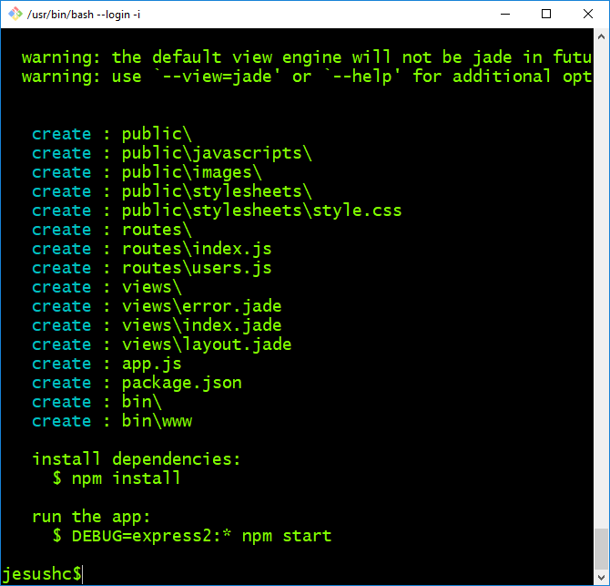
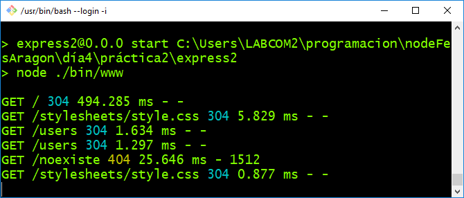
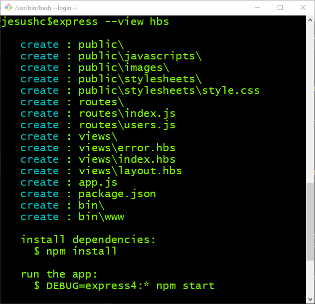
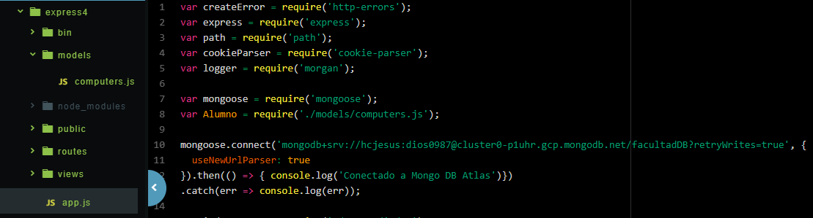
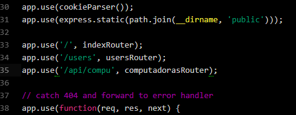
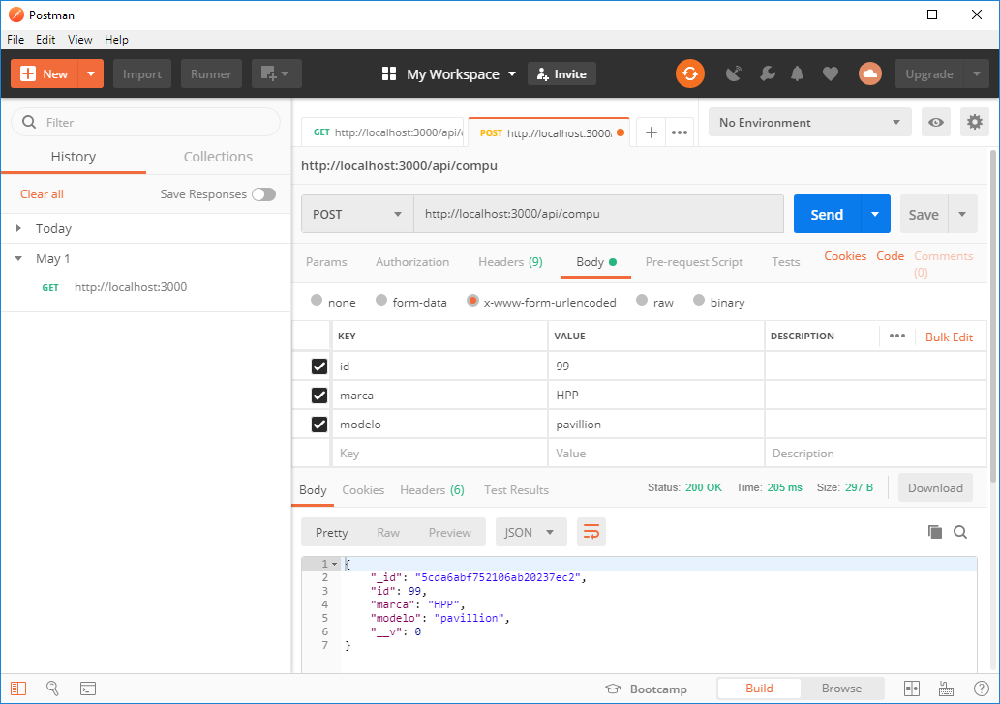
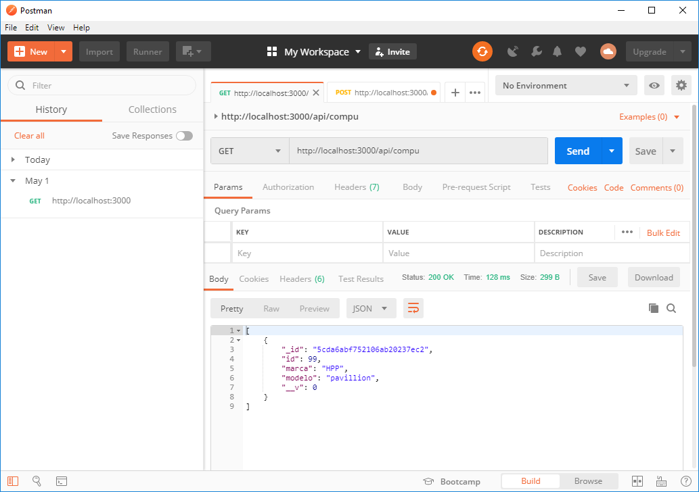

# Express generator

Express generator es un paquete de Node.js es una herramienta generadora de proyectos Express.

Para instalar express-generator teclea:
```
npm install -g express-generator
```

Una vez instalado es posible generar un proyecto Express con un solo comando
```
$ express
```



El cual genera una aplicación Express con sus configuraciones y  el Middleware por defecto.



### Express y motores de plantilla
Express  puede emplear como Middleware un motor de vista (View Engine), por defecto establece el motor Jade, sin embargo existen los siguientes:
- Pug
- Haml.js
- EJS
- hbs
- Squirrelly
- React
- h4e
- hulk-hogan
- combyne.js
- Nunjucks
- marko
- whiskers: Small, fast, mustachioed.
- hbs: Handlebars
- rivets-server
- Exbars
- Liquidjs
- express-tl
- vuexpress

Para configurar la máquina de render se debe establecer dos configuraciones:

**views**, el directorio donde se encuentran los archivos de plantilla.
```
 app.set('views', './views')
 ```
**view engine**, el motor de plantilla que se utiliza.
```
app.set('view engine', 'jade')
```

## Handlebars (view engine)
[Handlebars](https://handlebarsjs.com/)
 es una **view engine** que permite generar respuestas *html* con poco esfuerzo.

para generar un proyeto Express con handlebars ejecuta el comando:

```
express --view hbs <nombreDelProyecto>
```



### express3

Ejercicio crea el proyecto express3 con el comando anterior.

## express4
En el proyecto express 4 tenemos un proyecto con handlebars y mongoose.


### Instalar mongoose

```
npm install mongoose --save
```
Nuevo archivo package.json

```
{
  "name": "express4",
  "version": "0.0.0",
  "private": true,
  "scripts": {
    "start": "node ./bin/www"
  },
  "dependencies": {
    "cookie-parser": "~1.4.4",
    "debug": "~2.6.9",
    "express": "~4.16.1",
    "hbs": "~4.0.4",
    "http-errors": "~1.6.3",
    "morgan": "~1.9.1"
  }
}
```
El siguiente es el modelo.
```
var mongoose = require('mongoose');
var Schema = mongoose.Schema;

var ComputadoraSchema =  Schema({
  id: Number,
  marca:String,
  modelo:String
});

module.exports = mongoose.model('Computadora', ComputadoraSchema);

```
Código de conexión a mongoose y carga de modelo


Y la nueva ruta



El archivo manejador de ruta en el directorio router:

```
var express = require('express');
var router = express.Router();

var mongoose = require('mongoose');
var Computadora= require('../models/computers');

/* GET users listing. */
router.get('/', function(req, res, next) {
  Computadora.find({},function(err,datos){
    res.json(datos);
  });

});

/* nueva computadora*/
router.post('/', function(req, res, next) {
  console.log(req.body);
  var compu=  Computadora({
    id: req.body.id,
    marca:req.body.marca,
    modelo:req.body.modelo
  });

  compu.save(function(err,data){
    if (err) {
      res.send('error');
    }else {
      res.send(data);
    }
  });

});

module.exports = router;
```

Salvar un nuevo registro


Consultar todos

